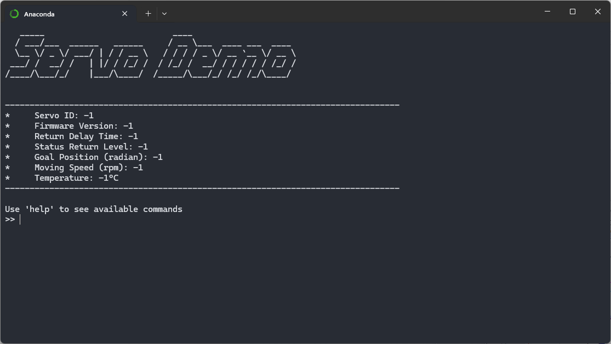
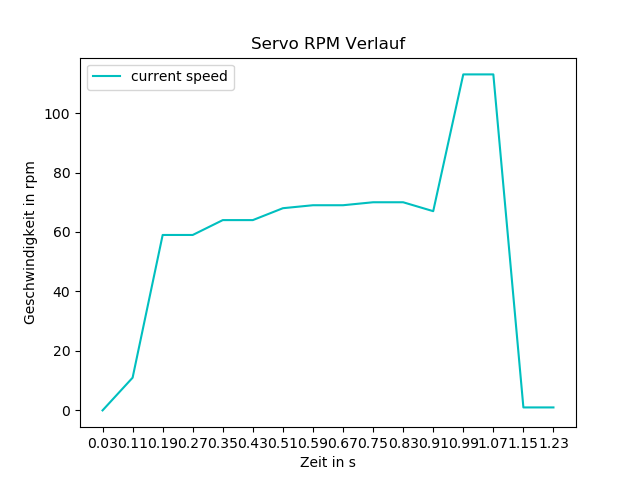

# servo-demo
This ```servo demo``` is part of the ). The demo provides several options to interact with the connected servos, e.g. ```show connected devices```, ```set id```, ```set speed```, ```set angle``` etc. Also a pytest sample is provided, which tests several positions, speeds, limits and provides a plot over time of the measured max supported speed of a given servo. 



## RPM Demo example

